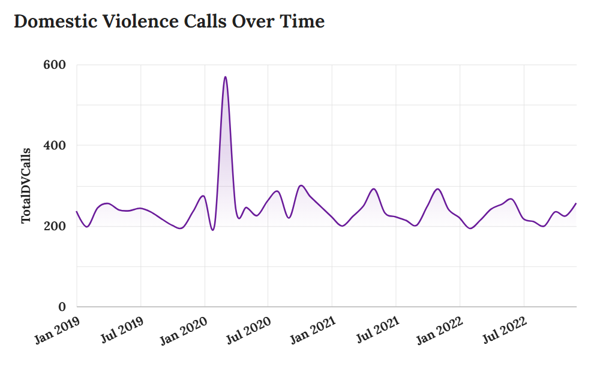
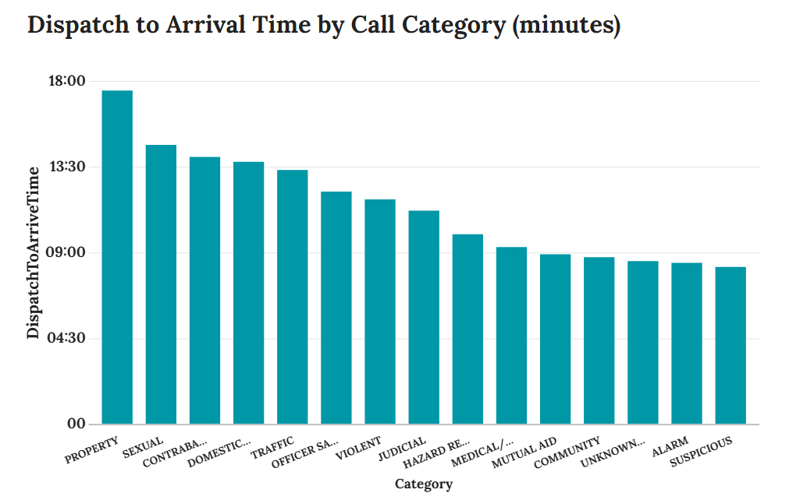
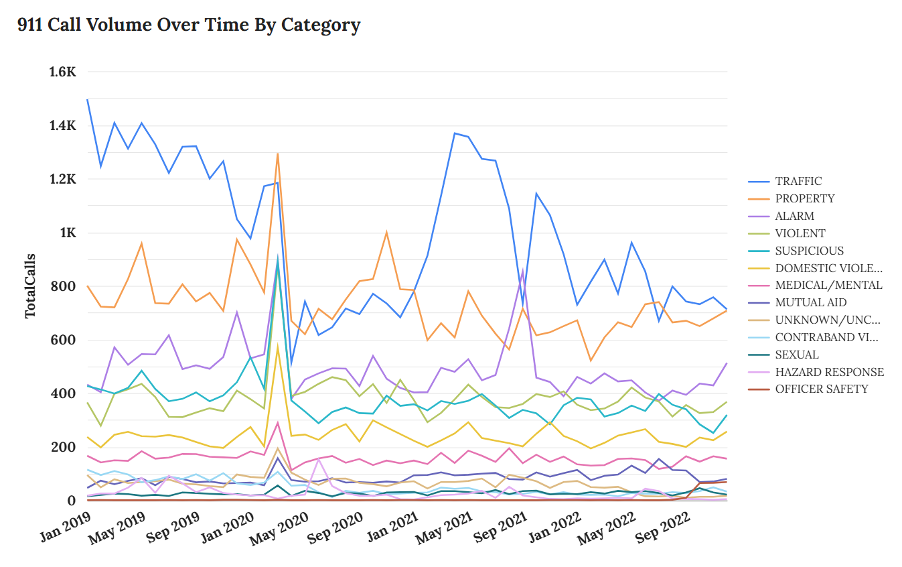
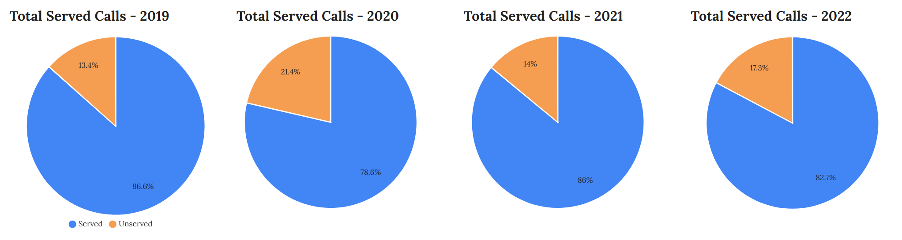
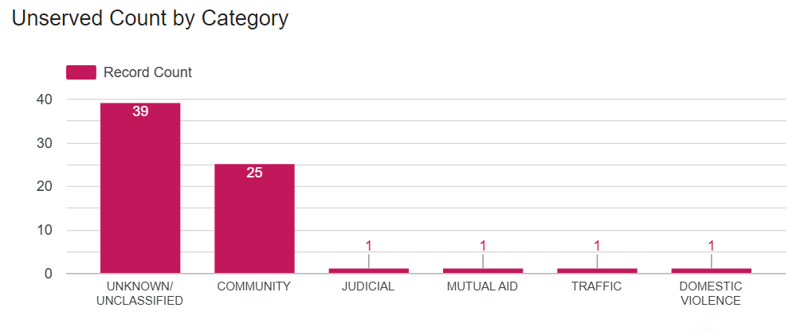

# nopd-cad-data-analysis
Analysis of NOPD 911 CAD data from 2019-2022 from the 3rd and 4th districts.
## Overview

This project analyzes New Orleans Police Department (NOPD) 911 Computer-Aided Dispatch (CAD) data spanning 2019 to 2022, focusing on the 3rd and 4th police districts. The goal is to understand police resource allocation, call volumes, and response patterns, especially around major events such as Mardi Gras and the COVID-19 pandemic.

## Project Objectives

- Analyze how 911 call volume changed during major events such as COVID-19 lockdowns and Mardi Gras
- Determine which call types and priorities were most likely to go unserved or receive delayed responses
- Examine trends in domestic violence and violent/property crime over time
- Identify geographic concentrations of specific incident types within the 3rd and 4th districts
- Support data-informed public safety decision-making in resource allocation and emergency response 

## Personal Motivation

As a former EMT who worked in the neighborhoods covered by the 3rd and 4th police districts, I approached this project with firsthand insight into the urgency and complexity of emergency response. My goal is to use data to support safer, more efficient public safety systems. 

## Project Status

- Cleaned and standardized 458,255 CAD records across 4 years (after filtering to the 3rd and 4th districts)
- Removed 11,213 DUPLICATE rows, 16,521 VOID rows, and 230 TEST INCIDENT rows
- Categorized 73 unique call types into 15 major categories
- Created four master tables:
  - All Calls (with served/unserved and self-initiated flags)
  - Unserved calls
  - Served, Self-Initiated
  - Served, Public-Initiated
- Response time metrics calculated (served only)
- Next steps: GIS Mapping

- ## Call Category Definitions

| Category          | Description / Examples                            |
|-------------------|-------------------------------------------------|
| Judicial          | Warrants, attachments, legal documents            |
| Community         | Area checks, missing person, noise complaint, etc.|
| Traffic           | Traffic stops, accidents, violations              |
| Property          | Burglary, theft, vandalism                        |
| Alarm             | Residential, commercial alarms                    |
| Unknown           | Calls with unspecified or unclear category        |
| Suspicious        | Suspicious persons or activity                    |
| Violent           | Assault, robbery, violent crimes                  |
| Hazard            | Fire, Flood, HAZMAT, Bomb Threat/Scare, etc.      |
| Domestic Violence | Calls related to domestic disputes                |
| Medical/Mental    | Medical emergencies, mental health crises         |
| Sexual            | Sexual assault or abuse                           |
| Contraband        | Drug and Weapons violations                       |
| Mutual Aid        | Assistance requests between agencies              |
| Officer Safety    | Incidents involving officer risk or threats       |


## Preliminary Observations

Early exploration of the cleaned dataset revealed several important patterns that shaped the direction of the project:

- **Self-initiated calls accounted for a large portion of all records**, but differed significantly in nature and response dynamics from public-initiated calls. This led to the decision to analyze them separately when calculating response times and evaluating unserved incidents.
- **Certain call types had multiple redundant or inconsistent labels**, such as different entries for assault, burglary, or alarms (i.e. aggravated assault, burglary (residence), or alarm (residential)). This complexity made clear the need to group similar call types into standardized categories for meaningful aggregation and trend analysis.
- **A significant number of calls lacked arrival timestamps**, signaling either officer non-response or poor data entry. These calls were flagged as unserved, and this insight influenced the decision to exclude them from response time calculation and analyze them as a separate group.
- **Timestamps varied in formatting across years**, especially in the raw CSV files. This required manual preprocessing in LibreOffice Calc to ensure BigQuery compatibility and led to the development of a consistent pipeline for timestamp standardization.

These early insights not only shaped the project's categorization system, filtering logic, and summary table design, but also emphasized the importance of separating data types (e.g., served vs unserved, public vs self-initiated) for reliable and interpretable results.

## Key Challenges & Decisions

- Managed inconsistent timestamp formats across years using LibreOffice Calc for SQL compatibility
- Removed ~23,000 invalid records (VOID, DUPLICATE, TEST INCIDENT) to improve data quality
- Designed a Served/Unserved flag based on officer arrival data to reflect response coverage
- Separated Self-Initiated vs Public-Initiated calls to preserve analytical clarity in response time metrics
- Recategorized ~250+ call types into 15 higher-level categories to support meaningful aggregation
- Verified and corrected geolocation columns to enable accurate mapping

## Findings & Visualizations

### Domestic Violence Spike During COVID-19 Lockdown



Based on my personal experience working in emergency response during the COVID-19 pandemic and lockdown, I hypothesized that domestic violence (DV) calls would show a sharp increase at the onset of lockdown, followed by a slow but steady decline back to pre-pandemic levels over time. However, the visualization revealed a different pattern. There was a clear spike in DV calls in March 2020, but the numbers returned to baseline by April 2020, suggesting the increase was temporary.

This abrupt return to baseline could be due to a range of factors. One possibility is that DV incidents were still occurring but not being reported — potentially due to isolation, fear, or lack of access to resources. To better understand this pattern, a deeper analysis using electronic police report (EPR) data from the same districts and time frame would be valuable. Comparing EPR and CAD data could reveal discrepancies in how incidents were reported or classified, and help determine whether the apparent decline in DV calls reflects a true decrease or a shift in reporting behavior.

### Response Times by Category



As expected, call categories involving more life-threatening situations generally received faster police response times. Officer response metrics are influenced by a range of factors, including distance to the call, traffic, weather, and what the officer was doing at the time of dispatch. Without access to these operational variables, it's difficult to explain the exact reasons behind specific response patterns.

One notable finding is that *medical and mental-health related calls consistently had the shortest average response times*. This data does *not* reflect EMS or fire department response times, which are typically slower due to the size and limitations of emergency vehicles. At the other end of the spectrum, *property-related crimes* received the slowest response times -- likely reflecting their lower urgency and risk to public safety.

This chart includes only *public-initiated calls* from the 3rd and 4th police districts between 2019 and 2022, and only those with a valid dispatch and arrival time. *Officer-initiated calls were excluded* because they often lack complete or meaningful dispatch/arrival timestamps -- likely due to how the NOPD CAD system logs self-initiated activity.


### Call Volume by Category



This visual shows a clear spike in 911 call volume across nearly all categories — except traffic-related calls — in **March 2020**, coinciding with the start of the **COVID-19 lockdown** in New Orleans, announced on **March 16, 2020**. Following this spike, call volumes declined across most categories and remained suppressed until the city began gradually reopening and residents returned to work. Notably, several call types never returned to their pre-pandemic volumes, including **Contraband Violations**, **Mutual Aid**, **Traffic**, and **Property** calls.

The NOPD 3rd and 4th Districts typically see heavy Mardi Gras activity, as many major parades march east along St. Charles Avenue toward downtown. However, careful examination of the data reveals **no consistent increase** in call volume during Mardi Gras periods, suggesting that parade season does not significantly impact police workload in these districts.

**Traffic-related calls** followed a distinct pattern. Starting in **January 2021**, these calls rose steadily, aligning with the city's **Phase 2 reopening**. This upward trend was interrupted by a sharp drop in **September 2021**, likely reflecting the impact of [**Operation Golden Eagle**](https://www.wdsu.com/article/new-orleans-louisiana-state-police-nopd-crime-results/37804087), an NOPD initiative launched during summer 2021 to crack down on drag racing and other "summer crimes." This decline suggests that the operation may have temporarily deterred street racing and related activity.

Around the same period, **alarm-related calls** increased. While no specific ordinances or procedural changes are documented, this rise may reflect shifts in alarm company protocols or increased enforcement efforts targeting false alarms.


### Served vs. Unserved Calls



These pie charts illustrate the proportion of **public-initiated 911 calls** that went unserved (i.e., no recorded officer arrival) in the 3rd and 4th police districts between 2019 and 2022. While total call volumes decreased in 2020 during the height of the COVID-19 pandemic, the percentage of calls that went unserved **increased significantly**, reaching a peak of **21.4%** — the highest of any year analyzed.

This finding was surprising, especially from the perspective of my own experience working in EMS, where it is extremely rare for a call to go entirely unserved. In emergency medical services, even during peak demand or resource constraints, there is usually a strong expectation that **every request for help receives a response** — even if delayed. The contrast here highlights a critical difference in how police services allocate resources and make triage decisions during crisis periods.

In 2020, the NOPD — like many departments nationwide — likely faced **staffing shortages**, with officers out sick, quarantined, or reassigned. Departments may have implemented **triaging protocols**, prioritizing high-risk or life-threatening situations (e.g., violent crimes, domestic violence, or mental health crises), while deprioritizing non-urgent calls such as property crimes or alarms. In some cases, officers may have responded by phone or closed out the call administratively without dispatching a unit — actions that appear as "unserved" in CAD data due to the absence of an arrival timestamp.

By 2022, the unserved rate had declined from 2020 but remained above pre-pandemic levels, suggesting that **longer-term operational shifts** may still be affecting service delivery. These findings raise important questions about how public safety agencies handle demand under strain — and how consistently different branches of emergency response are able to meet public expectations for service.



This bar graph shows the total number of **public-initiated 911 calls that went unserved** — meaning no recorded officer arrival — in the 3rd and 4th police districts from 2019 to 2022. Unlike earlier analyses that included all calls, this chart focuses exclusively on calls where the public requested police assistance, providing a clearer picture of true service gaps.

The data reveals a surprisingly low total of only **68 unserved public-initiated calls** across four years. Nearly 60% of these are categorized as **Unknown/Unclassified**, which may indicate issues with call categorization or record-keeping rather than true service failures.

The next most frequent category is **Community-related calls** (e.g., area checks, foot patrol requests), accounting for 25 unserved calls. The remaining unserved calls are spread across Judicial, Mutual Aid, Traffic, and Domestic Violence categories — each with only one or two instances. Some of these may reflect occasional misclassification errors between public-initiated and officer-initiated flags.

Overall, this refined analysis suggests that the NOPD in these districts is largely responsive to public requests, with very few calls going unserved when the public initiates contact. It also highlights the importance of careful data cleaning and categorization to avoid misleading conclusions.


---

More findings and visualizations may be added in the future.

## Conclusion

This project set out to explore how police response patterns, call volume, and service delivery evolved in two of New Orleans' most active police districts from 2019 to 2022. Drawing on over 450,000 cleaned CAD records, I examined how major events — like the COVID-19 lockdown and Mardi Gras — impacted emergency service demands, and how the NOPD allocated its resources in response.

A few themes emerged across nearly every visualization. The **onset of the COVID-19 pandemic** in March 2020 triggered sharp disruptions in call volume, response rates, and service consistency. Some call types — such as **domestic violence** — spiked briefly, while others (like **traffic** and **property** crimes) declined and never fully returned to pre-pandemic levels. These shifts appear closely tied to citywide lockdowns, mobility changes, and later, policy efforts like **Operation Golden Eagle**, which likely contributed to reduced traffic enforcement during specific periods.

One of the most unexpected findings involved the rate of **unserved 911 calls** — a metric that initially appeared alarmingly high. Coming from an **EMS background**, where almost every call is expected to receive a response, I was surprised to see unserved rates above 20% in 2020. But upon closer analysis — especially by separating **public-initiated** from **officer-initiated** calls — the picture became clearer: the vast majority of unserved calls came from officer-initiated activity (such as proactive patrols or administrative tasks), not from the public seeking help. In fact, only **68 public-initiated calls** across all four years went unserved, a figure that reflects much stronger service coverage than I initially assumed.

In exploring **response times**, I found patterns that aligned with practical frontline experience: calls involving **mental health or medical concerns** were typically handled faster than **property-related incidents**, which tend to be deprioritized. These nuances, while not always obvious in raw data, became more interpretable through careful categorization and contextual framing — especially when comparing self-initiated vs. public calls and using clearly defined incident groupings.

Ultimately, this project was both a technical and personal effort. My experience in emergency response shaped the questions I asked, they way I interpreted gaps or anomalies, and the urgency I brought to understanding how well the system serves those in crisis. By transforming a raw and complex dataset into structured insights and compelling visuals, I aimed to build a tool not just for analysis, but for **accountability, transparency, and informed decision-making** in public safety.

This work demonstrates the importance of bridging lived experience with analytical rigor — and the value of using data not just to answer questions, but to ask better ones.

## Tools & Technologies

- **Google BigQuery (SQL):** data querying, transformation, and analysis
- **LibreOffice Calc and Google Sheets:** Preprocessing timestamps and verifying formatting  
- **Looker Studio / Tableau (planned):** Visualization and dashboard creation
- **GitHub:** Version control and public-facing documentation

## Repository Structure

- `data-prep-sql/` — SQL scripts for data cleaning and categorization  
- `analysis/` — SQL queries for creating master tables and calculating response times  
- `visualizations/` — Placeholder for visualization files and dashboard exports  
- `docs/` — Project summaries, notes, and final reports

## Sample SQL Queries

Below are examples of key SQL queries used in the project. More detailed scripts are available in the `data-prep-sql/` and `analysis/` folders.

### 1. Creating Served/Unserved Flag

```sql
-- Example query to create served boolean flag based on arrival time (officer never arrived means call was unserved)
SELECT *,
  CASE
    WHEN CleanTimeArrival IS NULL THEN FALSE
    ELSE TRUE
  END AS Served
FROM `project.dataset.table_name`
```
### 2. Calculating Response Times
```sql
-- Example query calculating dispatch to arrival time difference in seconds
SELECT *,
  TIMESTAMP_DIFF(CleanTimeArrival, CleanTimeDispatch, SECOND) AS DispatchToArriveTime,
  TIMESTAMP_DIFF(CleanTimeArrival, CleanTimeCreate, SECOND) AS CreateToArriveTime
FROM `project.dataset.served_calls_table`
```
## Notes

- Self-initiated calls comprise a significant portion of the dataset and are analyzed separately due to differences in response metrics.
- Geolocation data was verified and corrected to ensure accuracy in spatial analysis.

## How to Reproduce

To replicate this project or build on it: 

1. Download 2019-2022 CAD datasets from the [NOLA Open Data Portal](https://data.nola.gov/Public-Safety-and-Preparedness/Calls-for-Service-Basic-View/6mc5-nn7g)
2. Preprocess timestamps using LibreOffice Calc or a paid desktop version of Excel (due to file sizes >100mb), or spreadsheet tool of choice to ensure BigQuery compatibility (convert to DATETIME yyyy-mm-dd hh:mm:ss)
3. Import cleaned CSVs into BigQuery.
4. Follow the SQL scripts in the `data-prep-sql/` folder to merge, clean, and categorize the data.
5. Use the `analysis/` queries to calculate response times and generate master tables.
6. Optional: Use Tableau or Looker Studio to build visualizations using the exported master tables.

> Note: This project focuses on the 3rd and 4th police districts and filters records accordingly during preprocessing.

## Future Work

- Develop and publish visualizations analyzing call volumes, response times, and category trends
- Perform geographic mapping of incidents by police district
- Finalize report summarizing key findings and recommendations

## Data Sources

- [NOLA Open Data Portal - 911 Calls for Service](https://data.nola.gov/Public-Safety-and-Preparedness/Calls-for-Service-Basic-View/6mc5-nn7g)
- [City of New Orleans - COVID-19 Response Orders](https://nola.gov/health/coronavirus/safe-reopening/phases/)
- [Mardi Gras Parade Schedules (2019–2022)](https://www.mardigrasneworleans.com/parades/schedule)
- [Operation Golden Eagle](https://www.wdsu.com/article/new-orleans-louisiana-state-police-nopd-crime-results/37804087)

## Skills Demonstrated

- SQL, Data Cleaning, Categorization, Data Modeling, Response Time Analysis, Geospatial Prep, Data Documentation

## Notes on Data Tables

- During this project, I created multiple intermediate and cleaned tables.
- Some tables may have been archived, renamed, or deleted after completed analysis.
- Queries reference those tables as they existed at the time of analysis.
- Query structure remains intact; this project is reproducible if table names reflect your own accurate ones.

*This project is ongoing. Updates and improvements will be regularly added to this repository.*
