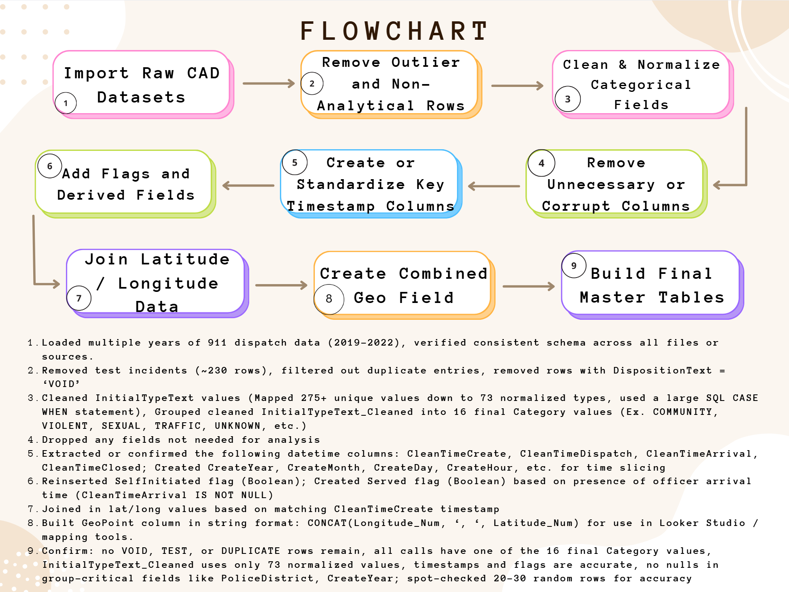

# Data Cleaning & Preparation Process – NOPD CAD Data Project

This document outlines the data cleaning, preparation, and enrichment process used in the NOPD Computer-Aided Dispatch (CAD) dataset analysis. The dataset includes over 1 million 911 call records spanning 2019–2022.

---

## 1. Import Raw CAD Datasets
- Loaded multiple years of 911 dispatch data (2019–2022)
- Verified consistent schema across all files or sources

## 2. Remove Outlier and Non-Analytical Rows
- Removed ~230 test incidents
- Filtered out duplicate rows
- Excluded rows with `DispositionText = 'VOID'`

## 3. Clean & Normalize Categorical Fields
- Cleaned `InitialTypeText` values, reducing 275+ raw types to 73 standardized values using a SQL `CASE WHEN` statement
- Mapped the cleaned types to 16 broader `Category` values:
  - e.g., VIOLENT, PROPERTY, SEXUAL, DOMESTIC VIOLENCE, MEDICAL/MENTAL, UNKNOWN, etc.

## 4. Remove Unnecessary or Corrupt Columns
- Dropped fields irrelevant to analysis or those containing only null or corrupt values

## 5. Create or Standardize Key Timestamp Columns
- Standardized datetime fields:
  - `CleanTimeCreate`, `CleanTimeDispatch`, `CleanTimeArrival`, `CleanTimeClosed`
- Extracted time features:
  - `CreateYear`, `CreateMonth`, `CreateDay`, `CreateHour`, etc.

## 6. Add Flags and Derived Fields
- Created `SelfInitiated` flag based on dispatch type
- Created `Served` flag based on whether `CleanTimeArrival` was present (i.e., officer arrived)

## 7. Join Latitude/Longitude Data
- Joined spatial coordinates (`Latitude_Num`, `Longitude_Num`) based on `CleanTimeCreate` timestamp

## 8. Create Combined Geo Field
- Built a `GeoPoint` field for mapping tools using:
  - CONCAT(Longitude_Num, ', ', Latitude_Num)
  
## 9. Build Final Master Tables
- Constructed four key master tables:
- All Calls (served + unserved)
- Served & Public-Initiated
- Served & Self-Initiated
- Unserved Calls
- Performed final verification:
- All calls have one of 16 `Category` values
- Confirmed no VOID, TEST, or duplicate rows remain
- Ensured timestamps, flags, and geo fields are fully populated
- Spot-checked 20–30 rows for consistency and accuracy

---

This document supports the visual flowchart and the SQL files stored in the `/sql` and `/analysis` directories.
